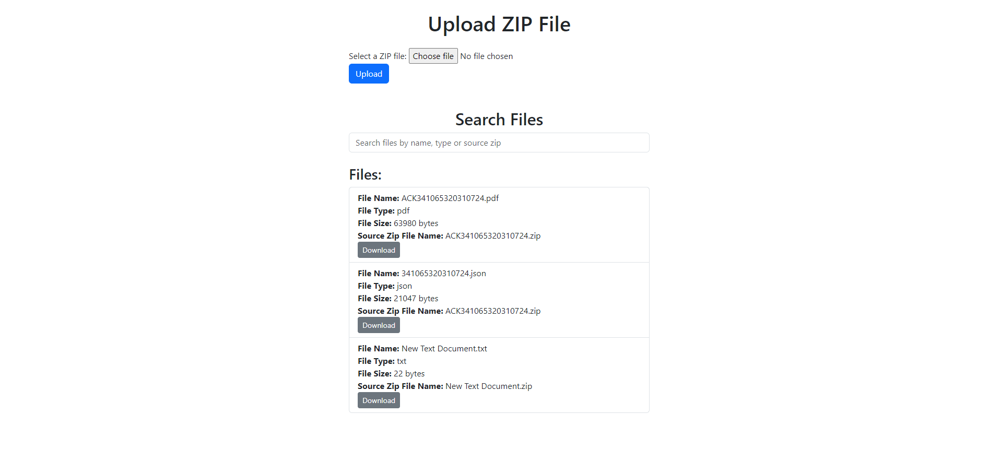

# File Bundle Uploader and Viewer

## Overview

This project is a web application designed to allow users to upload ZIP files containing documents, view file metadata, and search for files based on various attributes. The application is built using FastAPI for the backend, integrates with Elasticsearch for search functionality, and uses Amazon S3 for file storage. Celery is used for asynchronous processing of file metadata.

## Features

- **File Upload**: Upload ZIP files containing documents, which are stored in an Amazon S3 bucket.
- **File Metadata Processing**: Process metadata asynchronously using Celery, storing it in a SQL database and Elasticsearch.
- **Search Functionality**: Search for files by name, type, or source ZIP file name, with results fetched from Elasticsearch.
- **View File Content**: View the content of text files directly in the browser and download files as needed.
- **Download File**: Download files stored in the S3 bucket.

## Technologies

- **Backend**: FastAPI
- **Search Engine**: Elasticsearch
- **Database**: SQL (SQLAlchemy)
- **File Storage**: Amazon S3
- **Asynchronous Tasks**: Celery
- **Frontend**: HTML, Bootstrap, JavaScript
- **Containerization**: Docker and Docker Compose

## Prerequisites

### Install Docker and Docker Compose

#### For Linux

```bash
sudo apt update
sudo apt install -y apt-transport-https ca-certificates curl software-properties-common
curl -fsSL https://download.docker.com/linux/ubuntu/gpg | sudo gpg --dearmor -o /usr/share/keyrings/docker-archive-keyring.gpg

echo "deb [arch=amd64 signed-by=/usr/share/keyrings/docker-archive-keyring.gpg] https://download.docker.com/linux/ubuntu $(lsb_release -cs) stable" | sudo tee /etc/apt/sources.list.d/docker.list > /dev/null

sudo apt update
sudo apt install -y docker-ce docker-ce-cli containerd.io
sudo systemctl enable docker
sudo curl -L "https://github.com/docker/compose/releases/download/1.29.2/docker-compose-$(uname -s)-$(uname -m)" -o /usr/local/bin/docker-compose
sudo chmod +x /usr/local/bin/docker-compose
docker-compose --version
```

### For Windows
    Install Docker Desktop from the Docker website.

### Setup
## Configuration
1. **Set up AWS credentials**: Ensure your AWS credentials are correctly configured in the environment variables or a configuration file.

2. **Update environment variables**:

Create a `backend.env` file in your project directory using `backendExample` as a template

```bash
AWS_ACCESS_KEY=your-access-key
AWS_SECRET_KEY=your-secret-key
AWS_REGION=your-aws-region

LAMBDA_FUNCTION_NAME=your-lambda-function-name

S3_BUCKET=your-incoming-bucket
S3_FINAL_BUCKET=your-final-bucket

SQL_DATABASE_URL=postgresql://postgres:postgres@db:5432/file_bundle_uploader_db

ELASTICSEARCH_URL=http://elasticsearch:9200
ELASTICSEARCH_USERNAME=elastic
ELASTICSEARCH_PASSWORD=elastic

REDIS_URL=redis://redis:6379/0
```

3. ***Build and start the services***:

```bash
docker-compose up --build
```

This command will build the Docker images and start the services defined in `docker-compose.yml`, including the FastAPI server, Celery worker, and any other dependencies.

## Docker Compose Configuration
The `docker-compose.yml` file defines the services required for the application:

**fastapi**: The FastAPI server running the web application.
**celery**: The Celery worker responsible for processing file metadata.
**elasticsearch**: The Elasticsearch service for search functionality.
**postgres**: The PostgreSQL service for the SQL database.
**redis**: The Redis service for Celery.

## Accessing the Application

**Upload and Search Files**: Navigate to `http://localhost:8000` in your browser to access the file upload and search functionality.

## Pending Feature
**PDF Viewer**: Implementing a PDF viewer is still pending.

### Samples

1. ***File Bundle Uploader***

    